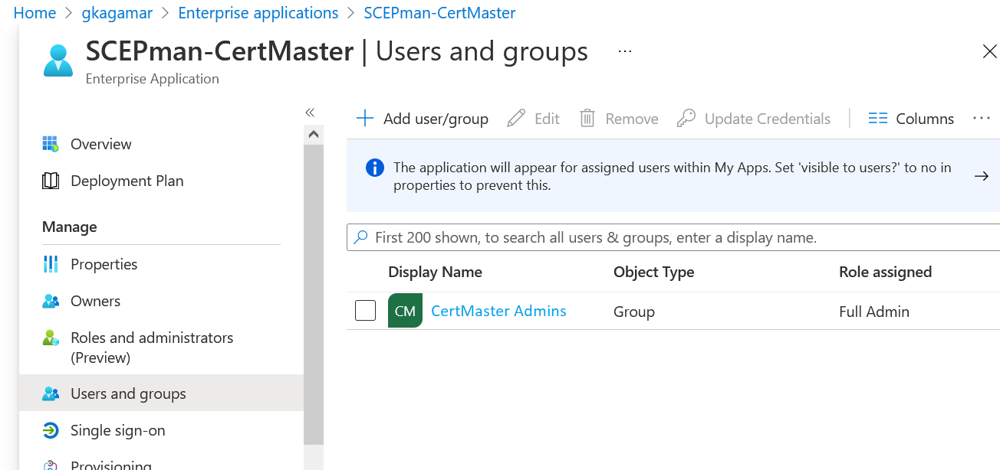

# SCEPman 2.x Deployment

The deployment of SCEPman 2.x is different to a SCEPman 1.x deployment. If you install a new SCEPman 2.x instance, you should follow the steps in this article. If you install a new SCEPman 1.x instance, you should follow the original guide.

If you want to upgrade from SCEPman 1.x to SCEPman 2.x, you can just auto-update (using a [channel with SCEPman 2.x](https://docs.scepman.com/scepman-configuration/optional/application-artifacts)). In order to use all new features, you need to perform some extra steps outlined later in this article.

## New SCEPman 2.0 Instance

### Deploy Azure Resources

Log in with an AAD Administrator account and visit this site. Click on a deployment link:

- Production channel is still on SCEPman 1.x
- <a href="https://portal.azure.com/#create/Microsoft.Template/uri/https%3A%2F%2Fraw.githubusercontent.com%2Fscepman%2Finstall%2Fmaster%2Fazuredeploy-beta.json" target="_blank">Beta Channel</a>
- <a href="https://portal.azure.com/#create/Microsoft.Template/uri/https%3A%2F%2Fraw.githubusercontent.com%2Fscepman%2Finstall%2Fmaster%2Fazuredeploy-internal.json" target="_blank">Internal Channel</a>

Fill out the values in the form, similar to this screenshot:

1. Select an existing resource group or create a new one. The SCEPMan resources will be deployed in this resource group.
2. Set the location according to your location
3. Define a name for key vault, app service plan, storage account, and for the two web sites. The two web sites are the SCEPman App Service and the CertMaster App Service. You will need the name of the SCEPman App Service later on.
4. Agree to the terms and conditions by clicking the checkbox
5. Click **Purchase**

### Configure App Registrations

Prerequistes:
- A Global Admin Account for the tenant to which you want to install SCEPman
- A workstation with [az CLI](https://docs.microsoft.com/en-us/cli/azure/install-azure-cli) installed (Alternatively: Azure Cloud Shell)

1. Download the <a href="https://raw.githubusercontent.com/scepman/install/master/setup/configure-scepman.psm1" target="_blank">SCEPman configuration PowerShell Module</a>.
2. Import the module and run `Register-SCEPman`. We recommend setting `$InformationPreference = "Continue"` to get more feedback about what's happening.
3. You will be asked for the name of SCEPman app service.
4. Log on with a Global Admin account when asked to.

### Create Root Certificate

* Follow instructions on the homepage of your SCEPman installation.

### Granting the Rights to Request Certificates via the Certificate Master Website

Create an AAD Group, possibly a Priviledged Access Group, for the people that shall be able to create web server certificates via CertMaster.

In the Azure Portal, visit [Enterprise applications](https://portal.azure.com/#blade/Microsoft_AAD_IAM/StartboardApplicationsMenuBlade/AllApps/menuId/). Select "All Applications" as Application type, search for *SCEPman-CertMaster*, and select the displayed application. Navigate to *Users and groups* and click *Add user/group* on the top menu. Select the group you have previously created. The role will automatically be chosen as *Full Admin*. After you hit *Assign*, direct members of the group can visit the Certificate Master website and request certificates. Note that using Certificate Master is an Enterprise feature. After assignment, the setting should look like this:

### Enable Certificate Master in SCEPman

Now you still need to tell SCEPman that requesting certificates via Certificate Master is enabled. For this, please add the application setting "AppConfig:DirectCSRValidation:Enabled" with the value "true" to the SCEPman app service (not Certificate Master).

## Upgrade from 1.x to 2.x

SCEPman 2.0 comprises two additional Azure resources, an Azure Storage account and an App Service called "Certificate Master". These are used to issue and manage the server certificates. But you can run SCEPman 2.0 also without them if you just go for the client certificates as before.

This means that you can [switch between channels in the main component as was possible before](https://docs.scepman.com/scepman-configuration/optional/application-artifacts).

### Add SCEPman Certificate Master

If you want to use the new SCEPman Certificate Master component to issue server certificates, you need to add the additional Azure resources and configure them. This also enables authentication as Managed Identity, one advantage of which is that you do not require any application secrets anymore. Thus, you also don't need to worry about expiration of application secrets. This is how you do it:

After upgrading the main component, you configure the wiring between the components with [the same method that you would use for a new installation](#configure-app-registrations). In contrast to a new installation, this will also create the two new Azure resources.

WARNING: The script currently does not yet support upgrading Deployment slots.

Using Certificate Master requires that you [assign the necessary rights](#granting-the-rights-to-request-certificates-via-the-certificate-master-website) to somebody and that you [enable certificate submission](#enable-certificate-master-in-scepman) in SCEPman.

## Downgrade from 2.x to 1.x

When it comes to the main SCEPman component, you can just switch between versions using [the WEBSITE_RUN_FROM_PACKAGE setting](https://docs.scepman.com/scepman-configuration/optional/application-artifacts#change-artifacts).

However, if you also used the PowerShell script to upgrade the internal wiring, there is one caveat: 2.x supports a different way of authentication to Graph and Intune using Managed Identities, which is also the new default and which is enabled by the script. If you downgrade your main component, it won't be able to use the new way of authentication and is missing one setting for the old one, so it won't work anymore. Thus, after a downgrade, you must manually change the application setting [AppConfig:AuthConfig:ApplicationKey](https://docs.scepman.com/scepman-configuration/optional/application-settings/azure-ad#appconfig-authconfig-applicationkey). The script renames the setting to `Backup:AppConfig:AuthConfig:ApplicationKey`, so you need to find the backup setting and rename it back to `AppConfig:AuthConfig:ApplicationKey`. Then the 1.x will work again using authentication based on App Registrations.
